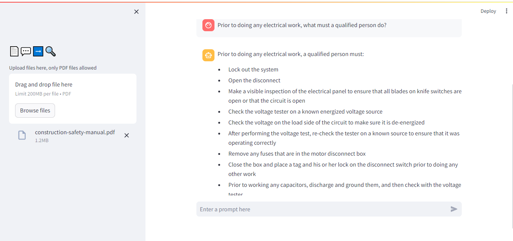

# Chatbot
Chat with your PDF file

Python | LangChain | Streamlit | Pinecone | OpenAI | OpenAIEmbeddings | RAG | ChatPromptTemplate | Retrieval Chain

## To run this app locally, follow these steps:
- Clone the repository
- Create a virtual environment
- Run `pipenv install -r requirements.txt`
- Run `streamlit run app.py`
